<h1 align="center">MiniPACS</h1>

<p align="center">
  <strong>Full-featured PACS portal for independent medical clinics</strong>
</p>

<p align="center">
  <a href="#features">Features</a> ·
  <a href="#screenshots">Screenshots</a> ·
  <a href="#architecture">Architecture</a> ·
  <a href="#quick-start">Quick Start</a> ·
  <a href="#development">Development</a> ·
  <a href="#deployment">Production Deployment</a> ·
  <a href="#license">License</a>
</p>

<p align="center">
  
  
  
  
  
</p>

---

## Why MiniPACS?

Solo and small clinics pay $150–$2,000/month for cloud PACS solutions that are overengineered for their needs. MiniPACS is a **self-hosted** alternative that gives you:

- Full DICOM storage and viewing — no cloud dependency, no per-study fees
- Patient portal with secure sharing — QR codes, PIN protection, email integration
- Study transfers between facilities — C-STORE with retry and error handling
- Professional admin interface — dark mode, collapsible sidebar, mobile responsive
- HIPAA-ready — audit logging, session management, encrypted storage

**One server. Zero recurring fees. Your data stays in your clinic.**

---

## Features

### DICOM Imaging
- Receive studies from MRI, CT, X-ray, Ultrasound equipment via **C-STORE**
- View studies in the built-in **OHIF DICOM Viewer** (zero-footprint, web-based)
- Fullscreen viewer mode with keyboard controls
- Support for all modalities: CT, MR, US, XR, DX, MG, NM, PT, RF, XA
- Series-level download in DICOM or JPEG format

### Worklist & Study Management
- Server-side search, filtering, and pagination
- Filter by modality, date range (presets + custom), patient name
- Click any study to view details, series breakdown, and launch viewer

### Patient Portal
- Secure share links with configurable expiry (7/14/30/90 days)
- Optional PIN protection with server-side enforcement (httponly cookies)
- QR code generation for easy sharing
- Email integration — pre-filled mailto with study details and portal link
- Mobile-first responsive design
- Patient-friendly JPEG download option

### PACS Transfers
- Send studies to other PACS nodes via DICOM C-STORE
- C-ECHO connectivity testing before sending
- Real-time transfer status tracking with auto-refresh
- Retry failed transfers with human-readable error messages

### Security & Compliance
- JWT authentication with token versioning and instant revocation
- Session timeout with 60-second warning modal (HIPAA requirement)
- Immutable audit log with CSV export
- Rate limiting on login attempts
- Content Security Policy, HSTS, X-Frame-Options headers
- DICOMweb access restricted to clinic LAN only

---

## Screenshots

### Dashboard & Worklist

| Dashboard | Worklist |
|-----------|----------|
| 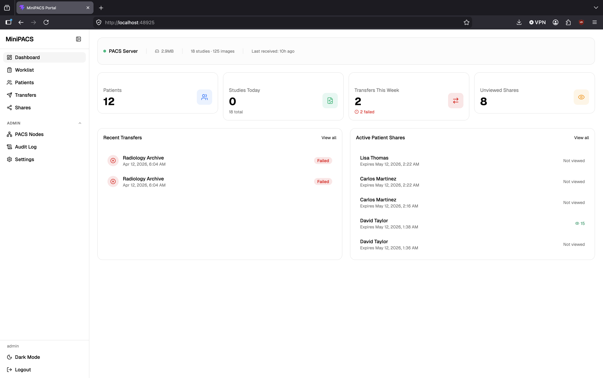 | 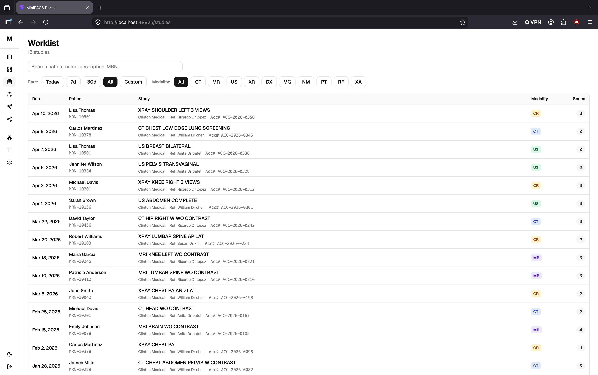 |

### Patients & Study Viewer

| Patients | Study Detail + Share |
|----------|---------------------|
| 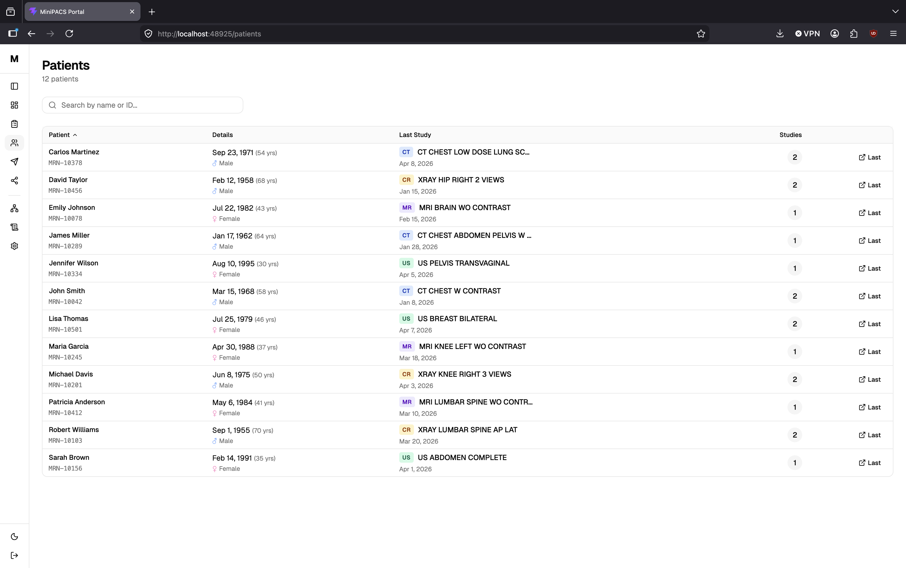 | 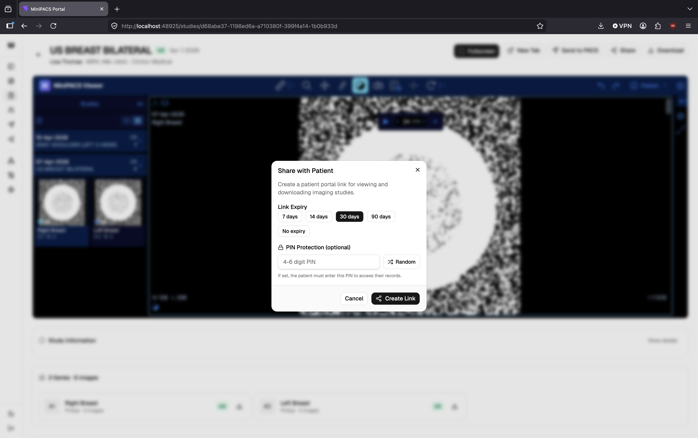 |

### Patient Sharing

| QR Code + Link | Patient Portal |
|---------------|----------------|
| 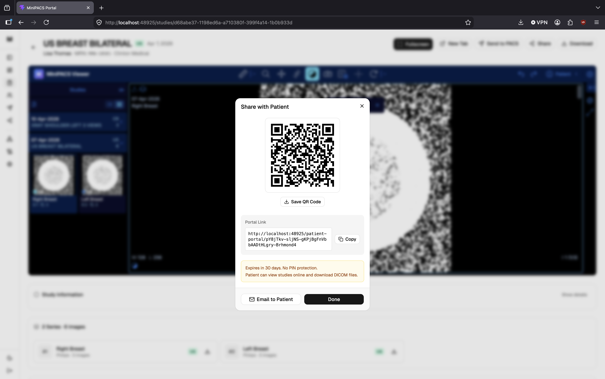 | 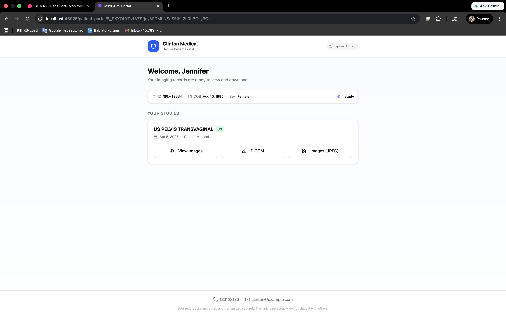 |

### Transfers & Shares

| Transfers | Patient Shares |
|-----------|---------------|
| 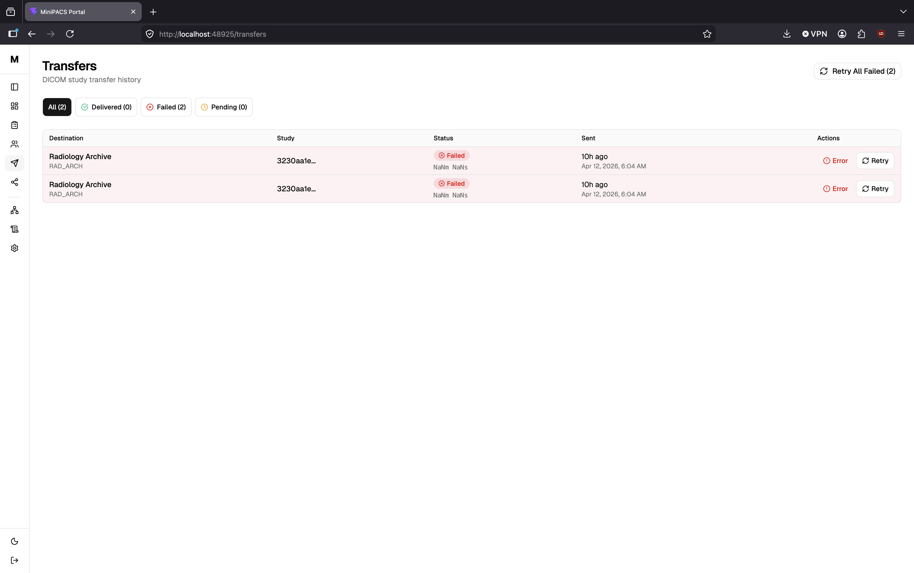 | 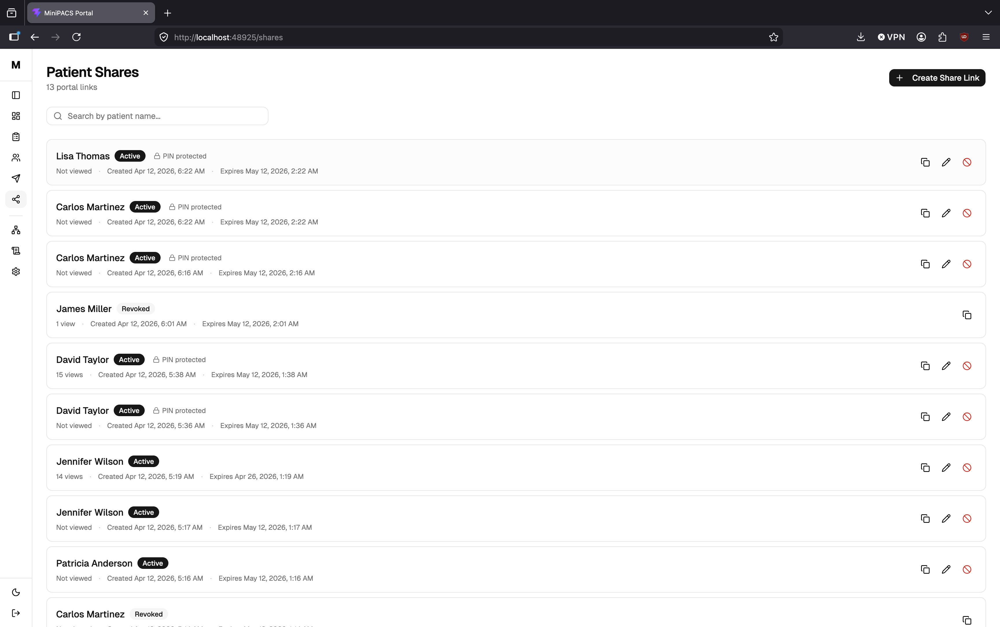 |

### Admin

| PACS Nodes | Settings — External Viewers |
|------------|---------------------------|
| 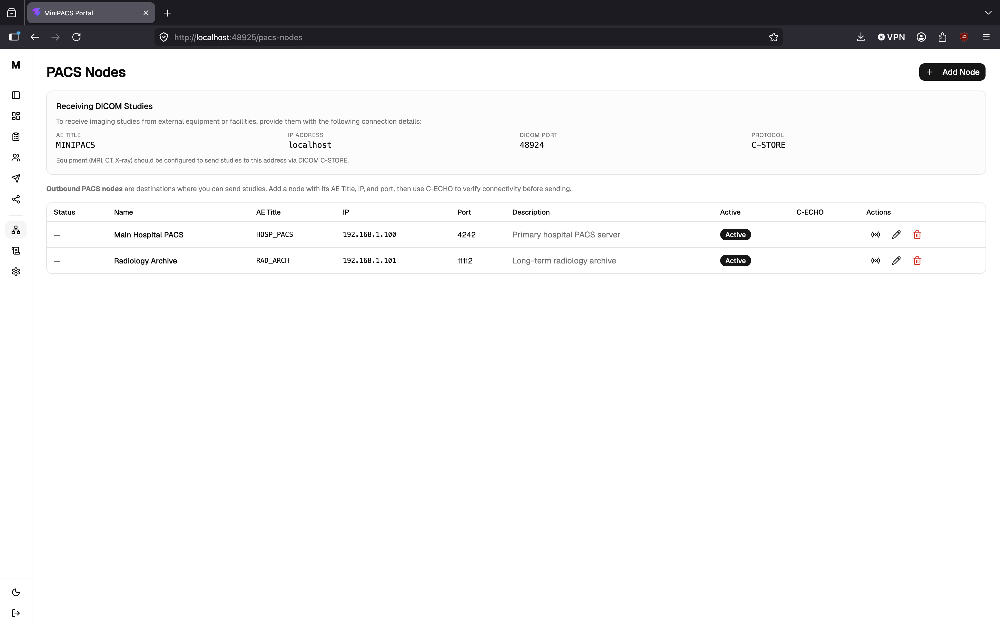 | 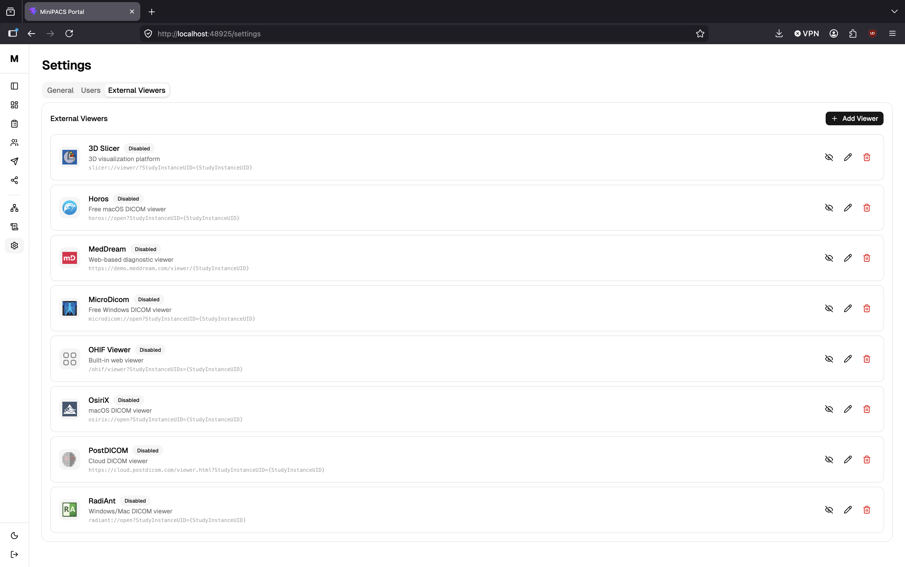 |

### Dark Mode

| Patients (Dark) | Audit Log |
|----------------|-----------|
| 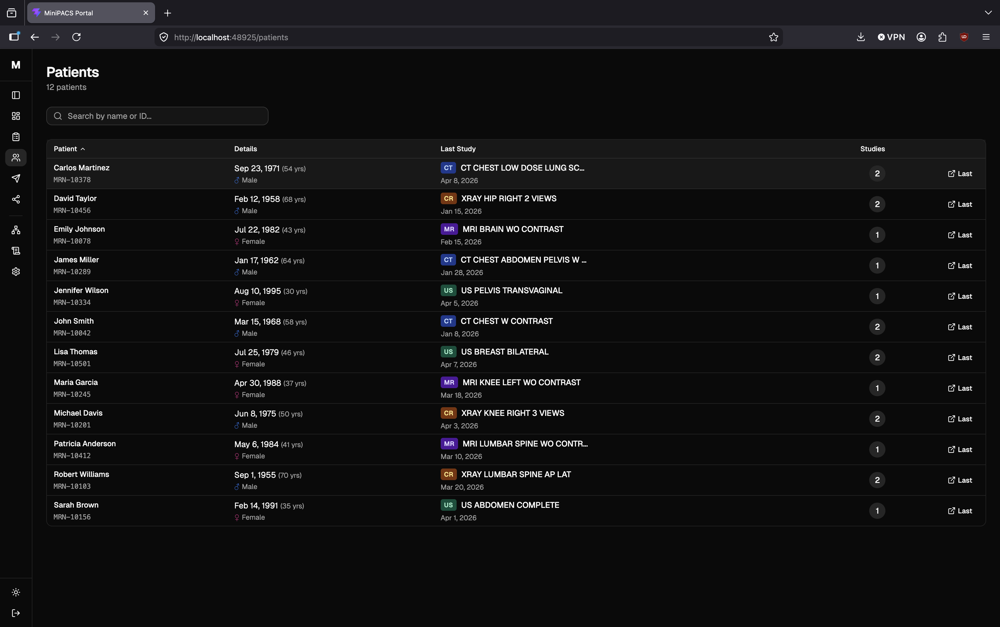 | 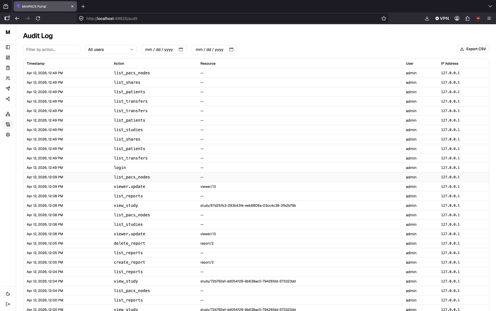 |

---

## Zero Cost Infrastructure

MiniPACS is designed to run on hardware you already own. No cloud subscriptions, no per-study fees, no vendor lock-in.

| What you need | What it costs |
|---------------|---------------|
| Any Windows PC in your clinic | **$0** — use existing hardware |
| Docker (runs inside WSL2 Ubuntu) | **Free** |
| Cloudflare Tunnel for HTTPS access | **Free** (included in free CF plan) |
| Domain name | **Free subdomain** on your existing domain, or ~$10/yr |
| SSL/TLS certificates | **Free** — Cloudflare handles it |
| DICOM storage | **Your own disk** — 2 TB SSD recommended |
| Backups | **Automated** — built-in cron script |

**Compare:** cloud PACS solutions charge $150–$2,000/month. MiniPACS: **$0/month**.

---

## Architecture

```
                    Internet                              Clinic LAN
                       │                                      │
         ┌─────────────┴──────────────┐          ┌───────────┴──────────┐
         │                            │          │                      │
   [Doctors/Patients]          [Other clinics]   │  [MRI / CT / X-ray]  │
         │                       │               │         │            │
         │ HTTPS                 │ C-STORE       │         │ C-STORE    │
         ▼                       │               │         ▼            │
   [Cloudflare]                  │               │   LAN IP:48924       │
         │ CF Tunnel             │               │         │            │
         ▼                       ▼               │         │            │
┌─── Docker Compose (on clinic PC) ──────────────┼─────────┤            │
│                                                │         │            │
│  [cloudflared] ──► [nginx]  ◄──────────────────┼─────────┘            │
│                      │  React SPA              │                      │
│                      │  /api/ ──► [FastAPI]     │                      │
│                      │  /ohif/ ── OHIF Viewer  │                      │
│                      │  /dicom-web/ ──┐        │                      │
│                                       ▼        │                      │
│                                [Orthanc PACS]◄─┼── port 48924 ◄──────┘
│                                   │            │
│                              [2 TB SSD]        │
└────────────────────────────────────────────────┘
```

### Four containers

| Container | Image | Purpose |
|-----------|-------|---------|
| `orthanc` | `orthancteam/orthanc` | PACS server — DICOM storage, DICOMweb API |
| `backend` | python:3.12-slim + FastAPI | Auth, API, business logic, SQLite |
| `frontend` | node build → nginx:alpine | Reverse proxy + React SPA + OHIF Viewer |
| `cloudflared` | cloudflare/cloudflared | Tunnel — secure HTTPS without open ports |

### Ports

| Port | Protocol | Exposed to | Purpose |
|------|----------|------------|---------|
| 48924 | DICOM | LAN + internet (port forward) | C-STORE / C-ECHO from equipment |
| 8080 | HTTP | localhost only | nginx → Cloudflare Tunnel |

> **No HTTP/HTTPS ports are exposed to the internet.** Cloudflare Tunnel handles all web traffic. Only DICOM port 48924 needs a port forward on the router.

### Data persistence (Docker volumes)

| Volume | Path in container | Contents |
|--------|-------------------|----------|
| `orthanc-data` | `/var/lib/orthanc/db` | DICOM images + Orthanc index |
| `minipacs-db` | `/app/data` | SQLite database (users, shares, audit, settings) |

---

## Quick Start

### Prerequisites

- **Docker** and **Docker Compose** (Docker Desktop or standalone)
- **Cloudflare account** (free) with a domain — for production HTTPS access

### Production deploy (one command)

```bash
git clone https://github.com/tr00x/MiniPACS.git
cd MiniPACS
./scripts/setup.sh
```

The setup script will:
1. Generate strong passwords and secrets automatically
2. Ask for your domain and Cloudflare Tunnel token
3. Build all Docker images
4. Create your admin account
5. Install daily backup cron job
6. Start everything

That's it. Open `https://your-domain.com` and log in.

### Local dev (self-signed TLS)

```bash
git clone https://github.com/tr00x/MiniPACS.git
cd MiniPACS
cp .env.docker .env        # Edit .env with your passwords
docker compose build
docker compose up -d
```

Open `https://localhost:48921` (accept self-signed cert warning).

### Load demo data (optional)

```bash
docker exec minipacs-backend-1 pip install pydicom numpy -q
docker exec minipacs-backend-1 python3 seed_demo.py
```

Creates 12 patients, 18 studies, 125 DICOM images.

### Common commands

```bash
# Production
docker compose -f docker-compose.prod.yml up -d      # Start
docker compose -f docker-compose.prod.yml down        # Stop
docker compose -f docker-compose.prod.yml logs -f     # Logs

# Development
docker compose up -d          # Start (dev mode with TLS)
docker compose down           # Stop
docker compose build          # Rebuild after code changes
```

---

## Development

For active frontend or backend development, you may want hot-reload instead of rebuilding Docker images on every change.

### Option A: Full Docker (recommended for testing)

Everything runs in Docker. To see your changes:

```bash
docker compose build          # Rebuild images
docker compose up -d          # Restart
```

### Option B: Hybrid — Docker backend + Vite frontend (for UI development)

Keep Orthanc and backend in Docker, run frontend locally with hot-reload:

```bash
# 1. Docker services are already running (docker compose up -d)

# 2. Run Vite dev server
cd frontend
npm install
npm run dev
```

Open `http://localhost:48925` — Vite proxies API calls to Docker backend on `:48922`.

> **Note:** Port 48925 is the Vite dev server with hot-reload.
> Port 48921 is the production nginx with pre-built static files.
> They serve the same app, but 48925 updates instantly when you edit code.

### Option C: Fully native (no Docker)

```bash
# 1. Start Orthanc via Docker
./scripts/start-orthanc.sh

# 2. Backend
cd backend
python -m venv .venv && source .venv/bin/activate
pip install -r requirements.txt
python -m app.create_user
uvicorn app.main:app --host 127.0.0.1 --port 48922 --reload

# 3. Frontend
cd frontend
npm install && npm run dev

# 4. (Optional) nginx for HTTPS
./scripts/generate-certs.sh
./scripts/start-all.sh
```

---

## Configuration

### Environment variables (.env)

All generated automatically by `setup.sh`. Manual reference:

| Variable | Required | Default | Description |
|----------|----------|---------|-------------|
| `SECRET_KEY` | Yes | — | JWT signing key (auto-generated) |
| `ORTHANC_USERNAME` | No | `orthanc` | Orthanc HTTP basic auth username |
| `ORTHANC_PASSWORD` | Yes | — | Orthanc HTTP basic auth password (auto-generated) |
| `ORTHANC_BASIC_AUTH` | Yes | — | Base64 of `username:password` (auto-generated) |
| `DOMAIN` | Yes | — | Your domain (e.g. `pacs.clinic.com`) |
| `CF_TUNNEL_TOKEN` | Yes | — | Cloudflare Tunnel token |
| `AUTO_LOGOUT_MINUTES` | No | `15` | Session inactivity timeout |
| `DEFAULT_SHARE_EXPIRY_DAYS` | No | `30` | Default patient share link expiry |

### DICOM equipment setup

Configure your imaging equipment to send studies to:

| Parameter | Value |
|-----------|-------|
| **AE Title** | `MINIPACS` |
| **IP Address** | Your server's IP |
| **Port** | `48924` |
| **Protocol** | DICOM C-STORE |

---

## Production Deployment

### What `setup.sh` handles for you

- [x] Strong passwords — auto-generated SECRET_KEY, ORTHANC_PASSWORD
- [x] TLS certificates — Cloudflare Tunnel provides HTTPS (no certs to manage)
- [x] No open ports — only DICOM 48924 needs port forward on router
- [x] Admin user creation — interactive prompt during setup
- [x] Daily backups — cron job at 2am, 30-day retention
- [x] CORS origins — auto-configured from your domain

### Cloudflare Tunnel setup

1. Go to [Cloudflare Zero Trust](https://one.dash.cloudflare.com/) → Networks → Tunnels
2. Create a tunnel, copy the token
3. Set the tunnel's public hostname to your domain (e.g. `pacs.clinic.com`)
4. Point it to `http://localhost:8080`
5. Paste the token when `setup.sh` asks

### Router configuration

Only one port forward needed:

```
Public IP : 48924  →  Server LAN IP : 48924  (TCP)
```

This allows imaging equipment and other clinics to send DICOM studies.

### Backups

Built-in `scripts/backup.sh` runs daily via cron:
- **SQLite** — safe online backup using `sqlite3.backup()`
- **Orthanc DICOM data** — compressed tar.gz from Docker volume
- **30-day rotation** — old backups auto-deleted
- **Logs** — `backups/backup.log`

Manual backup:
```bash
./scripts/backup.sh
```

### Storage planning

| Modality | Size per study | Daily volume (5-20 studies) |
|----------|---------------|----------------------------|
| MRI | 50–500 MB | 250 MB – 10 GB |
| CT | 100–800 MB | 500 MB – 16 GB |
| X-ray | 10–30 MB | 50 – 600 MB |
| Ultrasound | 5–50 MB | 25 – 1000 MB |

**Recommendation:** 2 TB SSD minimum, plan for ~500 GB – 1.5 TB per year.

---

## Project Structure

```
minipacs/
├── docker-compose.yml            # Full stack orchestration
├── .env.docker                   # Environment template
├── .env                          # Your configuration (git-ignored)
│
├── backend/
│   ├── Dockerfile                # python:3.12-slim + FastAPI
│   ├── app/
│   │   ├── main.py               # FastAPI app, lifespan, routers
│   │   ├── config.py             # pydantic-settings
│   │   ├── database.py           # SQLite schema + migrations
│   │   ├── services/orthanc.py   # Orthanc API client (httpx)
│   │   ├── routers/              # 12 routers (~50 endpoints)
│   │   └── middleware/audit.py   # Immutable audit logging
│   └── seed_demo.py              # Demo data generator
│
├── frontend/
│   ├── Dockerfile                # node build → nginx:alpine
│   └── src/
│       ├── pages/                # 13 page components
│       ├── components/           # shadcn/ui + custom components
│       └── lib/                  # API client, auth, DICOM utils
│
├── orthanc/
│   ├── orthanc.json              # Native Orthanc config
│   └── orthanc-docker.json       # Docker Orthanc config
│
├── nginx/
│   ├── nginx.conf                # Native nginx config
│   ├── nginx-docker.conf         # Docker nginx (dev, with TLS)
│   └── nginx-prod.conf           # Docker nginx (prod, HTTP for CF Tunnel)
│
├── ohif-dist/                    # Pre-built OHIF Viewer
├── ohif-config/minipacs.js       # OHIF white-label config
│
└── scripts/
    ├── setup.sh                  # One-command production setup
    ├── backup.sh                 # Automated daily backups
    ├── start-all.sh              # Native full-stack launcher
    ├── start-orthanc.sh          # Docker Orthanc launcher
    └── generate-certs.sh         # Self-signed TLS cert generator
```

---

## API Overview

| Endpoint Group | Routes | Description |
|---------------|--------|-------------|
| `/api/auth` | 4 | Login, logout, refresh, me |
| `/api/patients` | 2 | List (paginated), detail with studies |
| `/api/studies` | 5 | List (filtered), detail, download, series |
| `/api/transfers` | 3 | Send, retry, history |
| `/api/shares` | 4 | Create, update, revoke, list |
| `/api/pacs-nodes` | 5 | CRUD + C-ECHO test |
| `/api/reports` | 3 | Create, list, delete |
| `/api/settings` | 3 | Get, update, public (no auth) |
| `/api/viewers` | 4 | CRUD for external viewers |
| `/api/users` | 4 | CRUD + token revocation |
| `/api/audit-log` | 1 | Filtered, paginated log |
| `/api/stats` | 2 | Dashboard stats + system health |
| `/api/patient-portal` | 5 | Public: view, download, PIN verify |

---

## License

**Business Source License 1.1** — see [LICENSE](LICENSE).

- You can view, fork, and modify the code
- Non-commercial and educational use is permitted
- Commercial use requires a separate license
- Becomes Apache 2.0 on April 12, 2030

For commercial licensing inquiries: **tr00x@proton.me**

---

<p align="center">
  <sub>Built for clinics that want to own their imaging data.</sub>
</p>
