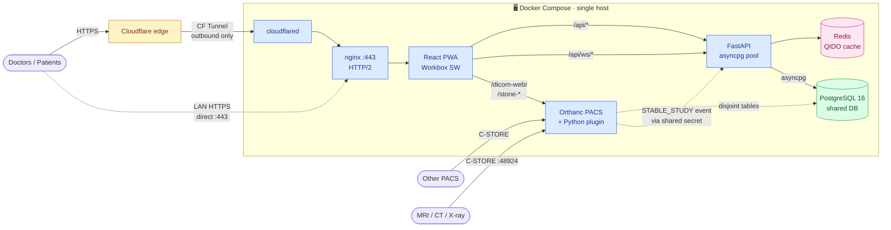

<div align="center">

# MiniPACS

### Self-hosted PACS portal for independent medical clinics

**One server. Zero recurring fees. Your data stays in your clinic.**

[](LICENSE)
[](https://github.com/tr00x/MiniPACS/commits/master)
[](https://github.com/tr00x/MiniPACS)
[](https://github.com/tr00x/MiniPACS/issues)

[](https://www.dicomstandard.org/)
[](docs/hipaa-notes.md)
[](frontend/)
[](backend/)
[](https://www.orthanc-server.com/)
[](https://www.postgresql.org/)

[**Why**](#why-minipacs) ·
[**What's different**](#what-makes-it-different) ·
[**vs Commercial**](#vs-commercial-pacs) ·
[**Features**](#features) ·
[**Screenshots**](#screenshots) ·
[**Architecture**](#architecture) ·
[**Quick Start**](#quick-start) ·
[**Docs**](#docs)

</div>

---

## Why MiniPACS?

> [!NOTE]
> Solo and small clinics pay **$150–$2,000/month** for cloud PACS that
> are overengineered for their needs and lock their data in someone
> else's data centre.

MiniPACS runs on a single Windows or Linux box you already own, sends
nothing outbound except optional Cloudflare Tunnel traffic, and costs
**$0/month** to operate. It is not a toy — the same image you would
build for a demo is the image clinics use to read MRIs in production.

**Six containers. One host. One `pg_dump` for backup.**

---

## What makes it different

These are the engineering decisions you will not find in commercial
PACS or in other open-source PACS projects. Each one is in production
at the pilot clinic right now.

### 1. Live worklist over WebSocket — no polling, ever

When a study lands from an MRI, the radiologist sees it in the browser
**within ~2 seconds**. Most PACS poll their worklist every 30–60 s.

```
MRI ─C-STORE─► Orthanc ─STABLE_STUDY event─► Python plugin
                                                  │
                            POST /api/internal/events/new-study
                            (shared-secret + RFC1918 IP allowlist)
                                                  │
                                                  ▼
                            Backend ─► invalidate Redis QIDO cache
                                    └─► fanout to /api/ws/studies
                                                  │
                                                  ▼
                            Frontend ─► invalidate React Query keys
                                     └─► toast "New study from <patient>"
```

> [!TIP]
> Result: zero polling load on Orthanc, zero stale worklists,
> sub-second perceived latency.

### 2. Shared PostgreSQL database with disjoint table names

Orthanc and the MiniPACS backend co-tenant **one PG database**. Orthanc
owns its `dicomidentifiers/dicomstudies/...` tables; MiniPACS owns
`users/shares/audit_log/...`. No name collisions, no separate
provisioning.

> [!IMPORTANT]
> **One `pg_dump orthanc` captures both applications' state.** No
> coordinated multi-DB backup, no consistency window between dumps.

### 3. Encapsulated PDF reports — radiologist reports live inside the study

Radiologist PDFs are encapsulated as DICOM Encapsulated PDF (SOP
`1.2.840.10008.5.1.4.1.1.104.1`) and attached to the study they
describe. Any DICOM viewer renders them inline. Reports travel with
the study on C-STORE, archive on the same disk, back up in the same
`pg_dump`.

Most PACS keep reports in a separate document store with a foreign-key
join — fine until you export a CD and discover the report does not
follow.

### 4. Resumable chunked upload with two-level dedup

Drop a folder of 50 GB DICOMs into the browser. Browser tab dies.
Network blips. WSL restarts. **Resume from where you left off.**

| Feature | How |
| --- | --- |
| Per-chunk persistence | PG-backed job state, chunk hash + file hash |
| File-level dedup | Skip chunk upload if Orthanc already has the SOPInstanceUID |
| Chunk-level dedup | Don't re-send the same chunk twice in the same job |
| Background continuation | Job survives import-dialog close — surfaces as a global UI pill |

> [!TIP]
> Production-tested on a 5,387-disc archive: 14k+ studies, **zero
> re-uploads on resume**.

### 5. Split-horizon HTTPS — LAN clients save 50–100 ms per request

```
WAN client  →  Cloudflare edge  →  CF Tunnel  →  nginx  →  backend
LAN client  ─────────────────────────────────►  nginx :443 (HTTP/2)
```

Same domain, same Cloudflare Origin Certificate, two paths. Resolved
by a UniFi DNS override on the clinic LAN. Perceptible on 500-slice
MRs where Stone fires dozens of metadata/frame requests in a burst.

### 6. Zero open inbound web ports

> [!CAUTION]
> The clinic firewall has **no inbound port forward for HTTPS**.
> Cloudflare Tunnel is outbound-only — `cloudflared` dials Cloudflare,
> traffic flows back through the tunnel. Eliminates an entire class
> of port-scan attacks.

The only inbound port forward is `48924` for DICOM C-STORE between
imaging facilities.

### 7. Five-layer cache, no N+1

| Layer | Caches | TTL |
| --- | --- | :---: |
| Service Worker (Workbox) | `/api/*` (NetworkFirst), Stone WASM (CacheFirst) | offline-aware |
| React Query + hover-prefetch | API responses + post-login warmup | session |
| nginx `proxy_cache` | `/dicom-web/` | **2 GB × 7 d** |
| Redis QIDO cache | `find_studies` / `find_patients` | **30 s fresh / 600 s stale** |
| In-process aggregate | `/api/studies/{id}/full` | **15 s** |

`asyncpg.Pool` (2–8) and httpx pool (`max_connections=100`,
keepalive 50) are TCP+auth-prewarmed at boot. CORS preflight cached
24 h on both sides. `orjson` default response class (5–10× faster
JSON serialize). Stone WASM preloaded via `<link rel="preload">`.

### 8. Pre-computed DICOM metadata — no disk reads on viewer open

`ExtraMainDicomTags` carries the OHIF/Stone-required tag set in the PG
index:

```
Rows · Columns · PixelSpacing · ImagePositionPatient
ImageOrientationPatient · WindowCenter · WindowWidth
RescaleSlope · RescaleIntercept · BitsAllocated · ...
```

Viewer metadata resolves from PG in microseconds, **never touches the
DICOM file on disk**. CF Tunnel's 100 s timeout never triggers, even
on 5,000-instance studies.

### 9. Token-versioned JWTs — instant session revocation

JWTs carry a `token_version` claim. Admin password change bumps
`users.token_version`; **every existing session invalidates on the
next request**, no session table lookup needed. **O(1) revocation.**

### 10. PWA with offline shell

Installable like a native app. Last-viewed worklist renders without
network. Workbox SW does `NetworkFirst` for `/api/*`, `CacheFirst` for
Stone WASM. Add to Home Screen / Dock and run in its own window.

---

## vs Commercial PACS

|  | Commercial cloud PACS | MiniPACS |
| --- | :---: | :---: |
| **Cost** | $150–$2,000 / month | **$0 / month** |
| **Data location** | Vendor data centre | **Your clinic disk** |
| **Worklist updates** | Polling, 30–60 s | **WebSocket, ~2 s** |
| **Web viewer** | Java applet or paid SaaS | **Stone WASM, ~1 MB, <1 s cold open** |
| **Reports** | Separate document store | **Encapsulated PDF DICOM** |
| **Bulk import** | Manual, restart on failure | **Resumable + 2-level dedup** |
| **Inbound web ports** | Exposed to internet | **Zero** (outbound CF Tunnel) |
| **Backup** | Vendor SLA, opaque | **One `pg_dump`** covers everything |
| **LAN performance** | Same as WAN | **HTTP/2 direct, 50–100 ms saved** |
| **Source** | Closed | **BSL 1.1** → Apache 2.0 in 2030 |
| **Vendor lock-in** | High — proprietary archive | **None** — DICOM in, DICOM out |

---

## Features

<details>
<summary><b>DICOM imaging</b> — ingest, viewers, external launchers</summary>

- DICOM ingest from any modality via C-STORE — AE Title `MINIPACS`, port `48924`
- Two web viewers: **Stone Web Viewer** (default, ~1 MB WASM) and **OHIF**
- URL launchers for OsiriX, RadiAnt, 3D Slicer, MicroDicom, MedDream
- All modalities: CT, MR, US, XR, DX, MG, NM, PT, RF, XA
- Series-level download — DICOM or JPEG

</details>

<details>
<summary><b>Worklist & study management</b> — live updates, thumbnails, keyboard nav</summary>

- Live worklist via WebSocket fanout from Orthanc `STABLE_STUDY` events
- Grid view with PNG thumbnails (pre-generated by Orthanc Python plugin, 2/s rate limit)
- Server-side search, filtering, pagination
- Filter by modality, date range (presets + custom), patient name
- Keyboard navigation (`/` `j` `k` `Enter`) and adjacent-study prefetch (`n` `p`)

</details>

<details>
<summary><b>Patient portal</b> — share links, PIN, QR, mobile-first</summary>

- Secure share links with configurable expiry (7/14/30/90 days)
- Optional PIN protection with server-side enforcement (httponly cookies)
- QR codes for in-clinic handoff
- Email integration — pre-filled mailto with study details and portal link
- Mobile-first responsive design
- JPEG fallback for non-DICOM viewers

</details>

<details>
<summary><b>Inter-clinic transfers</b> — C-STORE with retry & error reporting</summary>

- Send studies to other PACS nodes via DICOM C-STORE
- C-ECHO connectivity testing before sending
- Real-time transfer status with auto-refresh
- Retry failed transfers with human-readable error messages

</details>

<details id="security--compliance">
<summary><b>Security & compliance</b> — JWT, audit, password policy, encrypted backups</summary>

- JWT with `token_version` for **O(1) instant session revocation**
- bcrypt password hashes; **12+ char policy** with 3-of-4 character classes
  enforced at every entry point (`create_user`, `change_password`, admin API)
- Auto-logoff (default 15 min) with 60-second warning modal — HIPAA §164.312(a)(2)(iii)
- Immutable `audit_log` (every router action, user_id + IP + UTC ts) with CSV export
- Login rate limit
- AES-256-CBC encrypted backups (openssl + PBKDF2, 100k iterations) — HIPAA §164.312(a)(2)(iv)
- TLS everywhere — Cloudflare Tunnel for WAN, CF Origin Cert + HTTP/2 for LAN
- DICOMweb gated to LAN only
- CSP, HSTS, X-Frame-Options, X-Content-Type-Options

> [!IMPORTANT]
> See [`docs/hipaa-notes.md`](docs/hipaa-notes.md) for the full HIPAA
> Security Rule (45 CFR §164.312) implementation matrix, the clinic-side
> checklist (FDE, BAA with Cloudflare, off-site backup), and known
> roadmap items (MFA, DICOMweb access logging).

</details>

<details>
<summary><b>Operations</b> — autostart, watchdog, backup, secret rotation</summary>

- Daily backup cron (`pg_dump` + DICOM tar.gz, 30-day rotation)
- Windows Scheduled Tasks: `MiniPACS_Boot` + `MiniPACS_Watchdog`
- WSL systemd unit covers `wsl --shutdown` recovery
- One-shot `scripts/rotate-secrets.sh` regenerates all `.env` secrets
- Bumps `token_version` on admin password change

</details>

---

## Screenshots

<table>
<tr>
<td width="50%">

**Dashboard**


</td>
<td width="50%">

**Worklist**


</td>
</tr>
<tr>
<td width="50%">

**Study + Share**


</td>
<td width="50%">

**Patient Portal**


</td>
</tr>
</table>

**Patients view** — adapts to your colour-scheme preference:

<picture>
  <source media="(prefers-color-scheme: dark)" srcset="docs/assets/screenshots/patients-dark.png">
  <source media="(prefers-color-scheme: light)" srcset="docs/assets/screenshots/patients.png">
  
</picture>

<details>
<summary>More screenshots — audit log, transfers, shares, PACS nodes, viewers</summary>

| Audit log | Transfers |
| --- | --- |
|  |  |

| Patient shares | PACS nodes |
| --- | --- |
|  |  |

| External viewers | QR share |
| --- | --- |
|  |  |

</details>

---

## Architecture



| Container | Image | Role |
| --- | --- | --- |
| `postgres` | `postgres:16-alpine` | Shared index — Orthanc + MiniPACS, disjoint table names |
| `orthanc` | `orthancteam/orthanc` | DICOM ingest, DICOMweb, Stone, OHIF, Python plugin |
| `redis` | `redis:7-alpine` | QIDO cache (30 s fresh / 600 s stale, memory fallback) |
| `backend` | `python:3.12` + FastAPI + asyncpg | Auth, REST, WebSocket fanout, audit log |
| `frontend` | node build → `nginx:alpine` | React PWA, reverse proxy, LAN-HTTPS listener |
| `cloudflared` | `cloudflare/cloudflared` | Outbound CF Tunnel for WAN access |

> [!NOTE]
> Full breakdown — request paths, caching layers, auth surfaces,
> storage layout, schema boundary — in
> [`docs/architecture.md`](docs/architecture.md).

---

## Quick Start

### Production · one command

```bash
git clone https://github.com/tr00x/MiniPACS.git
cd MiniPACS
./scripts/setup.sh
```

The setup script generates strong passwords, asks for your domain
and Cloudflare Tunnel token, builds images, creates an admin user,
installs the daily backup cron, and starts the stack.

> [!TIP]
> Open `https://your-domain` and log in. That's it.

### Local dev · self-signed TLS

```bash
git clone https://github.com/tr00x/MiniPACS.git
cd MiniPACS
cp .env.docker .env        # edit passwords
docker compose up -d
```

Open `https://localhost:48921` (accept the self-signed cert).

<details>
<summary><b>Hot-reload frontend dev</b></summary>

```bash
docker compose up -d                # backend + Orthanc in containers
cd frontend && npm install && npm run dev
```

Vite on `http://localhost:48925` proxies `/api/*` to the Docker
backend on `:48922`. Hot-reload on every save.

</details>

<details>
<summary><b>Configure imaging equipment</b></summary>

| Parameter | Value |
| --- | --- |
| AE Title | `MINIPACS` |
| Host | server LAN IP |
| Port | `48924` |
| Protocol | DICOM C-STORE |

> [!IMPORTANT]
> Forward only port `48924` on your router for inter-clinic
> C-STORE. **Do not forward 80/443** — Cloudflare Tunnel handles
> WAN web traffic outbound-only.

</details>

---

## Docs

| Doc | For |
| --- | --- |
| [`docs/architecture.md`](docs/architecture.md) | Request paths, caching layers, auth surfaces, storage, schema boundary |
| [`docs/prod-hardening.md`](docs/prod-hardening.md) | Secret rotation, admin password, firewall, backups |
| [`docs/split-horizon-https.md`](docs/split-horizon-https.md) | Real TLS on LAN — CF Origin Cert, UniFi DNS override, portproxy `:443` |
| [`docs/wsl-autostart.md`](docs/wsl-autostart.md) | Windows Scheduled Tasks + WSL systemd unit for auto-recovery |
| [`docs/hipaa-notes.md`](docs/hipaa-notes.md) | HIPAA Security Rule implementation matrix + clinic-side checklist |
| [`CHANGELOG.md`](CHANGELOG.md) | Deploy-wave history (no semver — `master` is the product) |

---

## License

> [!WARNING]
> **Business Source License 1.1** — see [LICENSE](LICENSE).
>
> - View, fork, modify
> - Non-commercial and educational use permitted
> - **Commercial use requires a separate license**
> - Converts to **Apache 2.0** on April 12, 2030

For commercial licensing: **tr00x@proton.me**

---

<div align="center">

**Built for clinics that want to own their imaging data.**

<sub>If MiniPACS saved your clinic from a $2,000/month PACS bill — a star ⭐ goes a long way.</sub>

</div>
